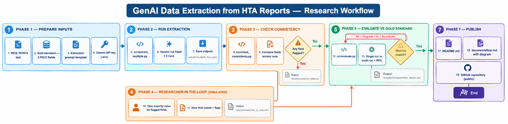

# GenAI Data Extraction from HTA Reports

**A proof-of-concept testing whether an LLM can reliably extract PICO data from a
NICE technology appraisal, and what happens when the model is consistently correct.**

Built in preparation for the Utrecht University PhD position on *Generative AI
in Health Technology Assessment*.

---

## 1. Objective

Test whether an LLM can extract 5 core PICO fields from a real NICE HTA report,
run the same prompt 5 times to check consistency, and evaluate the results
against a manually constructed gold standard.

## 2. Source Document

**NICE TA1074** — *Sparsentan for treating primary IgA nephropathy* (2025).\
Public guidance: https://www.nice.org.uk/guidance/ta1074

## 3. Workflow and Methodology



#

## 4. Repository Structure

```text
hta-genai-consistency/
├── README.md
├── requirements.txt
├── .env.example
├── data/
│   ├── manual_extraction.csv
│   └── source_reference.md
├── prompts/
│   └── extraction_prompt.txt
├── results/
│   ├── multiple_runs.json
│   ├── consistency_table.csv
│   └── comparison_table.csv
├── analysis/
│   ├── error_analysis.md
│   └── hta_context_reflection.md
└── src/
    ├── utils.py
    ├── extract_multiple.py
    ├── check_consistency.py
    └── evaluate.py
```

## 5. Getting Started

### Prerequisites
- Python 3.9+
- A Google Gemini API key

### Installation
```bash
# 1. Install dependencies
pip install -r requirements.txt

# 2. Set your Gemini API key
cp .env.example .env
# Edit .env and add your GEMINI_API_KEY

# 3. Place the NICE text in data/ta1074_clinical_effectiveness.txt
#    (see data/source_reference.md for instructions)
```

Running the Pipeline
```
# Run extraction 5 times (~5 API calls, ~1–2 minutes with pauses)
python src/extract_multiple.py

# Check consistency across runs
python src/check_consistency.py

# Evaluate against the gold standard
python src/evaluate.py
```

# 7.  References
- Versteeg et al. (2026). JAMIA Open, 9(2).
- NICE TA1074. https://www.nice.org.uk/guidance/ta1074 
- EU HTA Regulation (EU) 2021/2282
